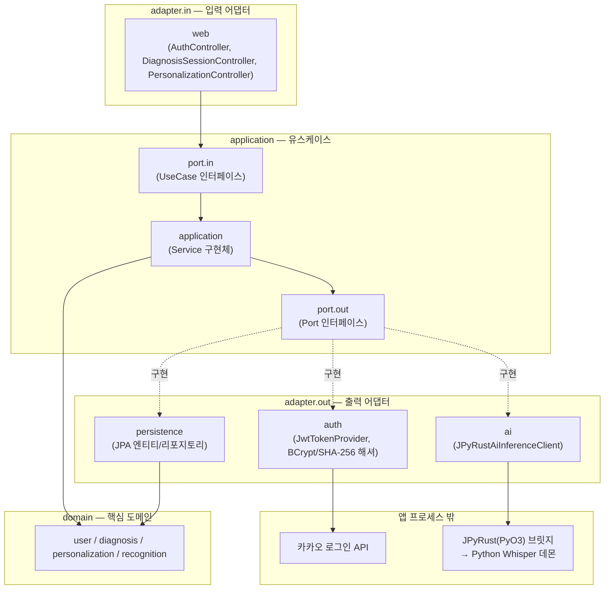

# 42VoiceBridge_BE

GSIA SW 챌린지(3주) — **AI 구음장애 보조 서비스**의 백엔드입니다. Whisper 음성 인식 모델을 (1) 공개 구음장애 데이터로 1차 적응 학습하고 (2) 사용자 개인 녹음으로 2차 개인화 학습해, 구음장애 발화를 텍스트로 정확히 변환하는 것이 목표입니다. 무작위/음소범위 기준이 아니라 **실제 인식 오류 패턴 기반으로 다음 등록 문장을 선택하는 오류 기반 적응형 등록**이 핵심 차별점입니다.

> 목표/타겟층/TTS 우선순위 등 서비스 기획 일부는 팀 회의로 확정 중입니다. 최신 요구사항은 Notion 문서를 우선 참고하세요.

## 기술 스택

| 구분 | 기술 |
|---|---|
| Language | Java 17 |
| Framework | Spring Boot 3.5.8 |
| Architecture | 헥사고날 아키텍처 (Ports & Adapters) |
| Database | MySQL/MariaDB (로컬/운영), H2 (테스트 — `src/test/resources/application.yml`로 분리) |
| Auth | Spring Security + JWT(jjwt 0.12.6), 이메일/비밀번호(BCrypt) + 카카오 로그인 |
| AI 연동 | [JPyRust](https://github.com/farmer0010/JPyRust)(PyO3) in-process 브릿지 → Python Whisper(OpenAI) 데몬 |
| Code Quality | Spotless(Google Java Format), Jacoco |
| Build | Gradle |

## 아키텍처

의존성은 항상 바깥(adapter)에서 안쪽(domain)으로만 흐릅니다. `domain`은 프레임워크에 의존하지 않습니다.



## 도메인별 구현 현황

3주 챌린지 특성상 각 도메인은 **계약(포트/인터페이스) 먼저 정의 후 일부 유스케이스만 완전 구현**하는 방식으로 진행 중입니다. 나머지는 컨트롤러 매핑 없이 TODO로 남아있어, 미구현 유스케이스를 호출해도 빌드가 깨지지 않습니다(빈 등록 자체가 없음).

### 인증 — 완료
- 이메일/비밀번호 회원가입·로그인
- 카카오 로그인 (프론트가 카카오 SDK로 받은 accessToken을 백엔드가 그대로 카카오 API에 검증 요청 — 백엔드가 카카오 REST API 키를 가질 필요가 없는 설계)
- JWT 액세스/리프레시 토큰 발급·재발급. refresh token은 SHA-256으로 별도 해싱해 저장(사용자 비밀번호용 BCrypt와 관심사 분리 — BCrypt는 72바이트 제한이 있어 JWT 길이의 토큰에는 쓸 수 없음)

### AI 음성 인식 연동 — 인프라 배선만 완료
- [JPyRust](https://github.com/farmer0010/JPyRust)(PyO3) in-process 브릿지로 실제 Whisper 모델을 호출하는 `AiInferenceClient` 구현체(`JPyRustAiInferenceClient`)
- 현재 PoC 단계로 Whisper 모델은 `tiny` 고정 (정확도 검증은 AI팀 담당, 추후 `base`/`small` 등으로 교체 예정)
- 이 구현체를 실제로 호출하는 인식 유스케이스(녹음 업로드 → 인식 → 결과 조회)는 아직 없음 — 현재는 어댑터 자체의 왕복 동작만 통합 테스트로 검증된 상태

### 진단 세션 — 세션 시작만 구현
- `POST /api/v1/diagnosis-sessions`: 낭독 문장을 뽑아 진단 세션을 시작
- 세션 조회 / 녹음 업로드 / 결과 조회 / 취약 음소 분석은 포트(유스케이스 인터페이스)만 정의된 상태 — [`NEXT-STEPS-diagnosis-session.md`](./NEXT-STEPS-diagnosis-session.md) 참고

### 개인화 — 모델 상태 조회만 구현
- `GET /api/v1/personalization/model`: 사용자 개인화 모델 상태 조회
- 녹음 업로드 / 학습 트리거 / 학습 상태 조회 / 실사용 인식은 포트만 정의된 상태 — [`NEXT-STEPS-personalization-recognition.md`](./NEXT-STEPS-personalization-recognition.md) 참고

### 로컬 개발용 시드 데이터
- `local` 프로파일에서만 동작하는 `SentenceSeeder` — `sentences` 테이블이 비어있으면 예시 문장 10개를 자동으로 채웁니다(재기동해도 중복 삽입되지 않음). 실제 낭독 문장 세트는 기획/AI팀이 확정하면 교체됩니다.

## API 목록

| # | 엔드포인트 | 인증 | 설명 |
|---|---|---|---|
| 1 | `POST /api/v1/auth/signup` | 불필요 | 이메일/비밀번호 회원가입 |
| 2 | `POST /api/v1/auth/login` | 불필요 | 이메일/비밀번호 로그인 |
| 3 | `POST /api/v1/auth/kakao` | 불필요 | 카카오 로그인 |
| 4 | `POST /api/v1/auth/refresh` | 불필요 | 액세스/리프레시 토큰 재발급 |
| 5 | `POST /api/v1/diagnosis-sessions` | JWT 필요 | 진단 세션 시작(낭독 문장 목록 반환) |
| 6 | `GET /api/v1/personalization/model` | JWT 필요 | 개인화 모델 상태 조회 |

> `/api/v1/auth/**`를 제외한 모든 API는 JWT 인증이 필요합니다(`POST /api/v1/auth/login`으로 발급, `Authorization: Bearer {token}` 헤더로 호출).

## 로컬 실행 방법

MySQL이 필요합니다(테스트는 H2를 자동으로 쓰므로 불필요).

```bash
docker run -d --name voicebridge-mysql \
  -e MYSQL_ROOT_PASSWORD=root \
  -e MYSQL_DATABASE=voicebridge \
  -p 3306:3306 \
  mysql:8.0

DB_USERNAME=root DB_PASSWORD=root ./gradlew bootRun --args='--spring.profiles.active=local'
```

- API는 `localhost:8080`에서 확인할 수 있습니다.
- 테스트: `./gradlew test` (H2 인메모리, MySQL 불필요)
- 포맷팅: `./gradlew spotlessCheck` / `./gradlew spotlessApply` (Google Java Format 기준)
- 커버리지: `./gradlew jacocoTestReport` → `build/reports/jacoco/test/html/index.html` (현재는 `build`/`check`를 막지 않는 warn-only)
- 커밋 시 자동 포맷팅을 원하면 `pre-commit install` 실행 — 자세한 내용은 [`CONTRIBUTING.md`](./CONTRIBUTING.md) 참고

## 팀 구성

| 역할 | 담당 영역 |
|---|---|
| 팀장·백엔드 리드 | 전체 아키텍처, Spring Boot 메인 서버, JPyRust 브릿지, 코드리뷰, API 명세 관리 |
| 백엔드 개발자 A | 회원/인증, 진단세션·녹음 업로드, 추천 문장 |
| 백엔드 개발자 B | AI 연동, 개인화 job, 실사용 인식 |
| 인프라 담당 | Docker Compose, Nginx/TLS, GPU 서버, 배포 |
| AI 담당 | 데이터 전처리, Whisper 적응/개인화 학습, 음소 분석 |
| 프론트엔드 담당 | React 웹앱 |

> 팀원 이름-역할 매핑은 아직 공식 확정 전이라 역할군만 기재했습니다. 확정되면 [`CLAUDE.md`](./CLAUDE.md)와 함께 갱신됩니다.

## 더 알아보기

- 전체 작업 이력/트러블슈팅 기록: [`PROGRESS.md`](./PROGRESS.md)
- 기여 가이드(브랜치 전략/커밋 컨벤션): [`CONTRIBUTING.md`](./CONTRIBUTING.md)
- AI 에이전트 작업 가드레일: [`CLAUDE.md`](./CLAUDE.md)
- 이어서 구현할 작업: [`NEXT-STEPS-diagnosis-session.md`](./NEXT-STEPS-diagnosis-session.md), [`NEXT-STEPS-personalization-recognition.md`](./NEXT-STEPS-personalization-recognition.md)
