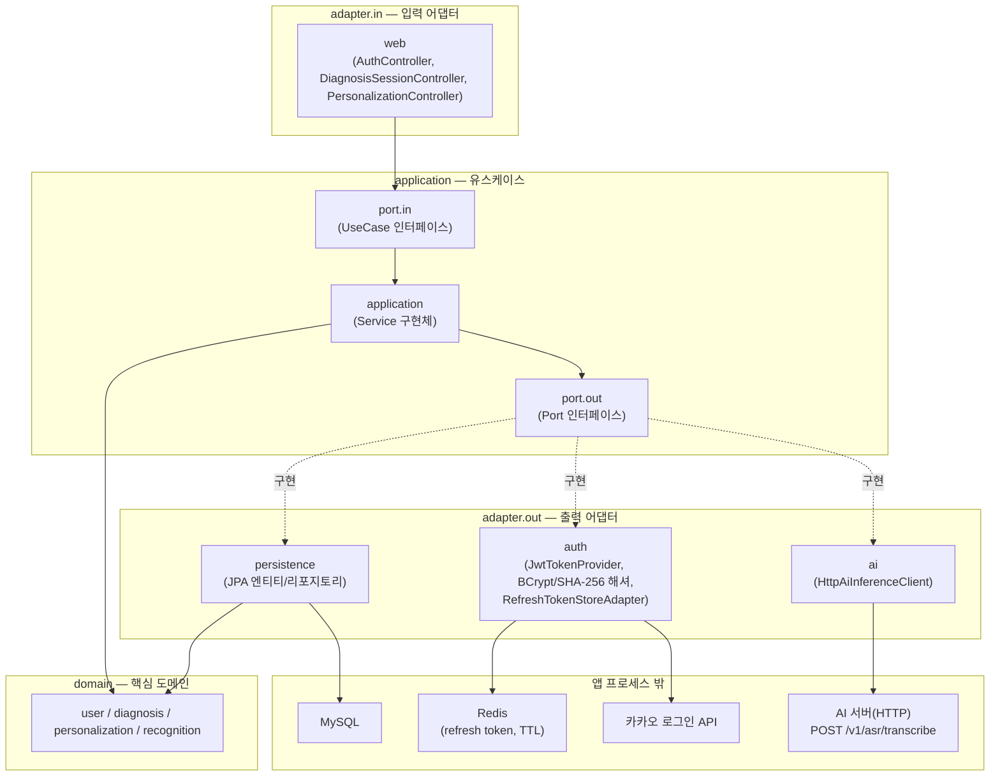
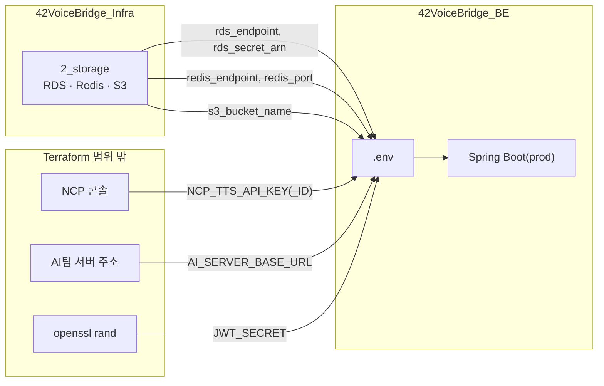

# 42VoiceBridge_BE

GSIA SW 챌린지(3주) — **AI 구음장애 보조 서비스**의 백엔드입니다. Whisper 음성 인식 모델을 (1) 공개 구음장애 데이터로 1차 적응 학습하고 (2) 사용자 개인 녹음으로 2차 개인화 학습해, 구음장애 발화를 텍스트로 정확히 변환하는 것이 목표입니다. 무작위/음소범위 기준이 아니라 **실제 인식 오류 패턴 기반으로 다음 등록 문장을 선택하는 오류 기반 적응형 등록**이 핵심 차별점입니다.

> 목표/타겟층/TTS 우선순위 등 서비스 기획 일부는 팀 회의로 확정 중입니다. 최신 요구사항은 Notion 문서를 우선 참고하세요.

## 기술 스택

| 구분 | 기술 |
|---|---|
| Language | Java 17 |
| Framework | Spring Boot 3.5.8 |
| Architecture | 헥사고날 아키텍처 (Ports & Adapters) |
| Database | MySQL/MariaDB (로컬/운영), H2 (테스트 — `src/test/resources/application.yml`로 분리) |
| Cache/Store | Redis (refresh token 저장 — TTL로 자동 만료) |
| Auth | Spring Security + JWT(jjwt 0.12.6), 이메일/비밀번호(BCrypt) + 카카오 로그인 |
| AI 연동 | HTTP(`RestClient`) → AI 서버(Python, Whisper 기반) — [JPyRust](https://github.com/farmer0010/JPyRust)(PyO3) in-process 브릿지는 `jpyrust-experiment` 프로파일로 실험적으로 보존 중, 기본 비활성 |
| API 문서 | springdoc-openapi(Swagger UI) — `/swagger-ui/index.html` |
| Code Quality | Spotless(Google Java Format), Jacoco |
| Build | Gradle |
| 로컬 인프라 | Docker Compose (MySQL, Redis) |

## 아키텍처

의존성은 항상 바깥(adapter)에서 안쪽(domain)으로만 흐릅니다. `domain`은 프레임워크에 의존하지 않습니다.


```mermaid
graph TB
    subgraph adapter_in["adapter.in — 입력 어댑터"]
        WEB["web<br/>(AuthController, DiagnosisSessionController, PersonalizationController)"]
    end

    subgraph application["application — 유스케이스"]
        PORT_IN["port.in<br/>(UseCase 인터페이스)"]
        SERVICE["application<br/>(Service 구현체)"]
        PORT_OUT["port.out<br/>(Port 인터페이스)"]
    end

    subgraph domain["domain — 핵심 도메인"]
        MODEL["user / diagnosis / personalization / recognition"]
    end

    subgraph adapter_out["adapter.out — 출력 어댑터"]
        PERSIST["persistence<br/>(JPA 엔티티/리포지토리)"]
        AUTH["auth<br/>(JwtTokenProvider, BCrypt/SHA-256 해셔,<br/>RefreshTokenStoreAdapter)"]
        AI["ai<br/>(HttpAiInferenceClient)"]
    end

    subgraph external["앱 프로세스 밖"]
        MYSQL["MySQL"]
        REDIS["Redis<br/>(refresh token, TTL)"]
        AISERVER["AI 서버(HTTP)<br/>POST /v1/asr/transcribe"]
        KAKAO["카카오 로그인 API"]
    end

    WEB --> PORT_IN
    PORT_IN --> SERVICE
    SERVICE --> MODEL
    SERVICE --> PORT_OUT

    PORT_OUT -.구현.-> PERSIST
    PORT_OUT -.구현.-> AUTH
    PORT_OUT -.구현.-> AI

    PERSIST --> MODEL
    PERSIST --> MYSQL
    AUTH --> REDIS
    AI --> AISERVER
    AUTH --> KAKAO
```

## 도메인별 구현 현황

3주 챌린지 특성상 각 도메인은 **계약(포트/인터페이스) 먼저 정의 후 일부 유스케이스만 완전 구현**하는 방식으로 진행 중입니다. 나머지는 컨트롤러 매핑 없이 TODO로 남아있어, 미구현 유스케이스를 호출해도 빌드가 깨지지 않습니다(빈 등록 자체가 없음).

### 인증 — 완료
- 이메일/비밀번호 회원가입·로그인
- 카카오 로그인 (인가 코드 방식, PR #41 — 프론트가 `Kakao.Auth.authorize()`로 받은 인가 코드를 백엔드가 카카오 토큰으로 교환해 사용자를 확인한다. 백엔드에 카카오 REST API 키와 Redirect URI 설정이 필요하다)
- 인증이 필요한 API를 토큰 없이 부르면 401 `AUTH_REQUIRED`, 토큰이 만료·위조됐으면 401 `AUTH_TOKEN_EXPIRED`(PR #46)
- JWT 액세스/리프레시 토큰 발급·재발급. refresh token은 SHA-256으로 별도 해싱해 **Redis**에 저장(사용자 비밀번호용 BCrypt와 관심사 분리 — BCrypt는 72바이트 제한이 있어 JWT 길이의 토큰에는 쓸 수 없음). Redis TTL로 만료를 자동 처리해 별도 정리(cleanup) 로직이 필요 없음 — **Redis가 기동되어 있지 않으면 로그인/refresh 자체가 실패**

### AI 음성 인식 연동 — HTTP 어댑터로 배선 완료
- `AiInferenceClient` 포트의 기본(v1) 구현체는 HTTP(`RestClient`) 기반 `HttpAiInferenceClient` — AI팀이 제공하는 `POST /v1/asr/transcribe`(raw WAV body, `user_id` 쿼리 파라미터)를 호출
- AI 서버 계약(v1)상 `score`(신뢰도)는 항상 `null` — `AiInferenceClient.RecognitionResult.confidence`는 `Double`(nullable)로 정의되어 있고, 도메인/영속성 계층까지 nullable로 반영됨
- 진단 녹음 업로드 후 비동기로 이 어댑터를 호출해 인식 결과를 반영하는 흐름(`RecordingRecognitionHandler`)이 실제로 배선되어 있음. 실사용 인식은 `POST /api/v1/recognitions`에서 `RecognizeSpeechUseCase`를 호출해 동기적으로 인식·저장 후 `200 OK`를 반환
- [JPyRust](https://github.com/farmer0010/JPyRust)(PyO3) in-process 브릿지 구현체(`JPyRustAiInferenceClient`)는 삭제되지 않고 `jpyrust-experiment` 프로파일로 실험적으로 보존 중 — 기본 프로파일에서는 비활성화됨
- 로컬(`local` 프로파일)에서는 실제 AI 서버 대신 `StubAiInferenceClient`가 고정 응답을 돌려줌. HTTP 어댑터를 실제로 띄워보려면 AI팀 mock 서버(`ASR_ENGINE=mock python3 demo/server.py`, 42VoiceBridge_AI 레포)가 `voicebridge.ai.http.base-url`(기본 `http://127.0.0.1:8000`)에 떠 있어야 함

### 진단 세션 — 5개 모두 구현
- `POST /api/v1/diagnosis-sessions`: 낭독 문장을 뽑아 진단 세션을 시작
- `GET /{sessionId}`: 세션과 문장별 녹음 상태를 반환해 프론트가 이어하기를 구현할 수 있다. 같은 문장을 다시 녹음한 경우 가장 최근 녹음을 노출한다
- `POST /{sessionId}/recordings`: multipart 음성을 저장하고 `PROCESSING`으로 기록한 뒤 **202 Accepted**를 즉시 반환. AI 인식은 트랜잭션 커밋 이후 별도 스레드에서 수행하고 결과를 `DONE` 또는 `FAILED`로 남긴다
- `GET /{sessionId}/recordings/{recordingId}/result`: 인식 결과와 정답 문장을 함께 반환
- `GET /api/v1/users/me/jamo-error-stats`: **자모 오류 통계**(구 취약 음소 분석). 사용자의 분석 완료 세션들을 누적해 AI가 계산하고, 백엔드는 스냅샷으로 보관한다. 세션은 문장마다 `DONE` 녹음이 하나씩 생기면 `ANALYZED`가 되고, 그 뒤엔 녹음을 받지 않는다(409). 표본이 부족한 자모는 `errorRate`가 `null`이다
- `Recording` 도메인은 상태 전이 `UPLOADED → PROCESSING → DONE | FAILED`를 직접 소유한다. 무음·비언어 오디오의 빈 인식 결과(`""`)는 **정상 완료**로 처리한다 — 구음장애 발화 특성상 인식 실패가 흔하고 그 패턴 자체가 분석 데이터이기 때문. `FAILED`는 AI 호출이 실패한 경우로, 비동기라 HTTP 응답으로 알릴 수 없어 상태로 남긴다
- 음성 저장은 `StoragePort` 뒤에 있다. 로컬 프로파일은 파일시스템, 그 외에는 S3를 쓰므로 **AWS 크레덴셜 없이도 개발할 수 있다**. 사용자가 보낸 파일명은 저장 키에 쓰지 않고 허용 목록의 확장자만 추출한다

### 추천 문장 — 구현
- `POST /api/v1/users/me/recommendations`: 개인화 등록용으로 읽을 문장을 추천. **문장 선택은 AI(`/v1/enroll/next-prompts`)가 하고**, 백엔드는 제안한 문장을 전략·버전·seed·문장 풀(버전·해시)과 함께 `shown_prompts`에 기록한다(AI 계약 §1, §3.6)
- 문장 ID는 우리 `sentences` 테이블이 아니라 AI 문장 풀의 `promptId`다. 이미 제안한 문장은 다음 추천에서 빠진다
- AI v1은 무작위(`random`) 선택만 지원한다. 오류 기반 선택은 AI 쪽 구현 이후
- 로컬(`local` 프로파일)은 `StubEnrollmentPromptClient`가 고정 12문장에서 고른다

### 개인화 — 모델·학습 작업 상태 조회 구현
- `GET /api/v1/personalization/model`: 사용자 개인화 모델 상태 조회
- `GET /api/v1/personalization/train/{jobId}`: 학습 작업 상태 조회
- 개인화 녹음 업로드 / 학습 트리거는 포트만 정의된 상태 — [`docs/NEXT-STEPS-personalization-recognition.md`](./docs/NEXT-STEPS-personalization-recognition.md) 참고

### Confirmation/TTS 게이트 — 구현 완료
- 인식 결과를 사용자가 최종 확정(Confirmation)하고, 그 확정된 텍스트만으로 TTS를 요청할 수 있게 하는 게이트. 같은 인식 결과에 재확인이 들어오면 이전 확인은 무효화되고, **무효화된 확인으로는 TTS 요청이 거부됨** — TTS는 AI가 인식한 원문이 아니라 사용자가 확정한 텍스트만 신뢰한다는 불변조건
- `TtsEnginePort`의 실제 구현체는 네이버 클라우드 플랫폼 CLOVA Voice(TTS Premium)를 호출하는 `NaverClovaVoiceAdapter` — 요청 접수(`PENDING`) 후 비동기로 합성해 성공하면 오디오를 `StoragePort`에 저장하고 `COMPLETED`로, 실패하면 `FAILED`로 전이한다

### 진단 문장 시드 데이터
- `SentenceSeeder` — 로컬과 배포 환경 모두에서, `sentences` 테이블이 비어 있으면 진단용 예시 문장 10개를 자동으로 채웁니다(재기동해도 중복 삽입되지 않음). 문장이 없으면 진단 세션을 시작할 수 없기 때문입니다.
- `voicebridge.diagnosis.seed-sentences`로 켜고 끕니다(기본 켬, 테스트 설정에서는 끔).
- 실제 낭독 문장 세트는 기획/AI팀이 확정하면 교체됩니다. 이미 문장이 들어간 환경은 비어 있지 않아 자동으로 바뀌지 않으므로, 교체 작업이 따로 필요합니다.

## API 목록

| # | 엔드포인트 | 인증 | 설명 |
|---|---|---|---|
| 1 | `POST /api/v1/auth/signup` | 불필요 | 이메일/비밀번호 회원가입 |
| 2 | `POST /api/v1/auth/login` | 불필요 | 이메일/비밀번호 로그인 |
| 3 | `POST /api/v1/auth/kakao` | 불필요 | 카카오 로그인. 본문 `{ "authorizationCode": "..." }` |
| 4 | `POST /api/v1/auth/refresh` | 불필요 | 액세스/리프레시 토큰 재발급 |
| 5 | `POST /api/v1/diagnosis-sessions` | JWT 필요 | 진단 세션 시작(낭독 문장 목록 반환) |
| 6 | `GET /api/v1/diagnosis-sessions/{sessionId}` | JWT 필요 | 세션 조회(문장별 녹음 상태 포함) |
| 7 | `POST /api/v1/diagnosis-sessions/{sessionId}/recordings` | JWT 필요 | 녹음 업로드(multipart). 업로드 때 WAV로 변환하고 접수만 한 뒤 `202` 반환. 잘못된 오디오는 `400 AUDIO_TOO_SHORT`·`AUDIO_TOO_LONG`·`AUDIO_INVALID` |
| 8 | `GET /api/v1/diagnosis-sessions/{sessionId}/recordings/{recordingId}/result` | JWT 필요 | 인식 결과 조회(정답 문장 포함) |
| 9 | `GET /api/v1/personalization/model` | JWT 필요 | 개인화 모델 상태 조회 |
| 10 | `POST /api/v1/recognitions/{recognitionId}/confirm` | JWT 필요 | 인식 결과 확인(같은 인식 결과 재확인 시 이전 확인 무효화) |
| 11 | `POST /api/v1/tts` | JWT 필요 | 확인된 텍스트로 TTS 요청(무효화된 확인으로는 요청 불가). 비동기로 CLOVA Voice 합성 후 완료 |
| 12 | `GET /api/v1/tts/{ttsId}` | JWT 필요 | TTS 요청 상태 조회 |
| 13 | `POST /api/v1/recognitions` | JWT 필요 | `audioFile` multipart 업로드 → 인식·저장 결과 (`200`) |
| 14 | `POST /api/v1/users/me/recommendations` | JWT 필요 | 개인화 등록용 추천 문장. 문장은 AI가 고르고, 제안한 문장을 기록한다. 본문 `{ "count": 10 }`(생략 가능, 1~50) |
| 15 | `GET /api/v1/users/me/jamo-error-stats` | JWT 필요 | 자모 오류 통계(분석 완료 세션 누적). 표본 부족이면 `errorRate: null` |

> `/api/v1/auth/**`를 제외한 모든 API는 JWT 인증이 필요합니다(`POST /api/v1/auth/login`으로 발급, `Authorization: Bearer {token}` 헤더로 호출).

## 실사용 인식 업로드

`POST /api/v1/recognitions`는 `multipart/form-data`의 필수 `audioFile`을 받습니다.
인증된 사용자의 인식 결과를 저장한 뒤 `200 OK`와 기존 `RecognitionResponse`를 반환합니다.
`userId`는 요청 필드가 아니라 JWT에서 가져옵니다.

```bash
curl -X POST http://localhost:8080/api/v1/recognitions \
  -H "Authorization: Bearer $ACCESS_TOKEN" \
  -F 'audioFile=@speech.wav;type=audio/wav'
```

응답 `data` 필드: `recognitionId`, `recognizedText`, `modelUsed`, `confidence`.
결과는 `GET /api/v1/recognitions` 및 `GET /api/v1/recognitions/{recognitionId}`로 조회합니다.
필수 파일 누락·빈 파일은 `400 VALIDATION_FAILED`, AI 호출 실패는 기존 서비스 계약대로
`503 AI_INFERENCE_UNAVAILABLE`입니다. 빈 인식 문자열과 `confidence: null`은 정상 결과입니다.

실사용 업로드는 실제 파일 내용을 검사하여 PCM WAV, WebM(Opus/Vorbis), 오디오 전용
M4A/MP4(AAC)를 **WAV PCM16·모노·16kHz·0.3~30초**로 변환합니다.
파일명·MIME은 판별 근거로 쓰지 않습니다. 원본은 모노 또는 단일 화자의 스테레오만
지원하며 스테레오는 `(L + R) / 2`로 합칩니다. 서로 반대 위상의 채널은 상쇄될 수 있고,
화자가 한 명인지 자동으로 판별하지는 않습니다. 다중 스트림·3채널 이상은 거절합니다.
길이는 변환된 샘플 수로 검사하며 30초 초과 음성을 잘라서 성공 처리하지 않습니다.
무음은 정상 입력으로 AI에 전달합니다.

실행 환경에 `ffmpeg`와 `ffprobe`가 필요합니다(macOS: `brew install ffmpeg`).
`FFMPEG_PATH`와 `FFPROBE_PATH`로 실행 파일 경로를 지정할 수 있습니다.
기본 제한은 파일 10MiB, 전체 multipart 11MiB, 변환 20초, 앱 인스턴스당 동시 변환 2건입니다.
`voicebridge.audio.queue-timeout`(기본 2초) 동안 슬롯을 기다린 후에도 없으면 실패합니다.
손상·미지원·길이/업로드 초과는 `400 VALIDATION_FAILED`, 변환 대기 초과·처리 시간 초과는
`503 AUDIO_PROCESSING_UNAVAILABLE`, 변환기 미설치 등 서버 설정 문제는
`500 INTERNAL_SERVER_ERROR`입니다. AI 호출 실패의 기존 503 응답은 유지합니다.

원본과 중간 파일은 처리 중 임시 파일로만 사용하고 성공·실패 시 정리를 시도하며, 정리 실패는 로그로 남깁니다.
원본 형식·코덱·채널·샘플레이트, 변환 버전과 전후 SHA-256을 인식 ID와 연결하여 로그에 남깁니다.
DB 메타데이터 영구 보존은 후속 작업입니다. 이 변환은 실사용 인식과 진단 업로드에 함께 적용합니다.
진단 업로드는 거절 이유를 `AUDIO_TOO_SHORT`·`AUDIO_TOO_LONG`·`AUDIO_INVALID`(400)로 나눠 알리고, 원본 대신 변환된 WAV를 저장해 인식에 씁니다.

`./gradlew build`는 일반 테스트를, `./gradlew audioIntegrationTest`는 실제 FFmpeg 변환 및
업로드 연결 테스트를 실행합니다. 후자는 FFmpeg/FFprobe 설치가 필수입니다.
기본 `local` 프로파일은 AI 스텁을 사용합니다. 실제 변환 테스트에서도 AI 포트는 대체하므로
실제 모델 추론·실제 브라우저 녹음 파일의 호환성은 별도 검증 대상입니다.

## 로컬 실행 방법

MySQL과 Redis가 필요합니다(테스트는 H2 + Testcontainers Redis를 자동으로 쓰므로 둘 다 불필요).

```bash
docker-compose up -d   # MySQL, Redis
./gradlew bootRun
```

- API는 `localhost:8080`에서 확인할 수 있습니다.
- API 문서(Swagger UI): `localhost:8080/swagger-ui/index.html` — JWT가 필요한 엔드포인트는 우측 상단 `Authorize`에 `Bearer {accessToken}`을 넣으면 호출까지 가능합니다.
- Redis가 떠 있지 않으면 로그인/refresh가 실패합니다 — `docker-compose up -d`를 먼저 실행했는지 확인하세요.
- 테스트: `./gradlew test` (H2 인메모리 + Testcontainers Redis 자동 기동, 로컬 MySQL/Redis 불필요. 단 Testcontainers가 Docker 데몬을 사용하므로 Docker Desktop은 켜져 있어야 함)
- 포맷팅: `./gradlew spotlessCheck` / `./gradlew spotlessApply` (Google Java Format 기준)
- 커버리지: `./gradlew jacocoTestReport` → `build/reports/jacoco/test/html/index.html` (현재는 `build`/`check`를 막지 않는 warn-only)
- 커밋 시 자동 포맷팅을 원하면 `pre-commit install` 실행 — 자세한 내용은 [`docs/CONTRIBUTING.md`](./docs/CONTRIBUTING.md) 참고

## 배포

`SPRING_PROFILES_ACTIVE=prod`로 뜰 때 필요한 환경변수 대부분은 인프라([`42VoiceBridge_Infra`](https://github.com/42VoiceBridge/42VoiceBridge_Infra), Terraform 레이어형 구조 `1_base`/`2_storage`/`3_application`)의 output에서 가져옵니다.


```mermaid
graph LR
    subgraph infra["42VoiceBridge_Infra"]
        L2["2_storage<br/>RDS · Redis · S3"]
    end

    subgraph manual["Terraform 범위 밖"]
        NCP["NCP 콘솔"]
        AITEAM["AI팀 서버 주소"]
        OPENSSL["openssl rand"]
    end

    subgraph be["42VoiceBridge_BE"]
        ENV[".env"] --> SPRING["Spring Boot(prod)"]
    end

    L2 -- "rds_endpoint, rds_secret_arn" --> ENV
    L2 -- "redis_endpoint, redis_port" --> ENV
    L2 -- "s3_bucket_name" --> ENV
    NCP -- "NCP_TTS_API_KEY(_ID)" --> ENV
    AITEAM -- "AI_SERVER_BASE_URL" --> ENV
    OPENSSL -- "JWT_SECRET" --> ENV
```

변수별 상세(용도, 정확한 조회 명령, 로컬 기본값으로 충분한지 여부)는 [`docs/DEPLOYMENT.md`](./docs/DEPLOYMENT.md)를, 값을 채우는 템플릿은 [`.env.example`](./.env.example)을 참고하세요.

## 팀 구성

| 역할 | 담당 영역 |
|---|---|
| 팀장·백엔드 리드 | 전체 아키텍처, Spring Boot 메인 서버, AI 연동(HTTP) 브릿지, 코드리뷰, API 명세 관리 |
| 백엔드 개발자 A | 회원/인증, 진단세션·녹음 업로드, 추천 문장 |
| 백엔드 개발자 B | AI 연동, 개인화 job, 실사용 인식 |
| 인프라 담당 | Docker Compose, Nginx/TLS, GPU 서버, 배포 |
| AI 담당 | 데이터 전처리, Whisper 적응/개인화 학습, 음소 분석 |
| 프론트엔드 담당 | React 웹앱 |

> 팀원 이름-역할 매핑은 아직 공식 확정 전이라 역할군만 기재했습니다. 확정되면 [`CLAUDE.md`](./CLAUDE.md)와 함께 갱신됩니다.

## 더 알아보기

- 배포 환경변수 전체 목록·출처: [`docs/DEPLOYMENT.md`](./docs/DEPLOYMENT.md)
- 전체 작업 이력: [`docs/PROGRESS.md`](./docs/PROGRESS.md)
- 트러블슈팅(에러 메시지 → 원인 → 해결): [`docs/TROUBLESHOOTING.md`](./docs/TROUBLESHOOTING.md)
- 기여 가이드(브랜치 전략/커밋 컨벤션): [`docs/CONTRIBUTING.md`](./docs/CONTRIBUTING.md)
- AI 에이전트 작업 가드레일: [`CLAUDE.md`](./CLAUDE.md)
- 이어서 구현할 작업: [`docs/NEXT-STEPS-diagnosis-session.md`](./docs/NEXT-STEPS-diagnosis-session.md), [`docs/NEXT-STEPS-personalization-recognition.md`](./docs/NEXT-STEPS-personalization-recognition.md)
