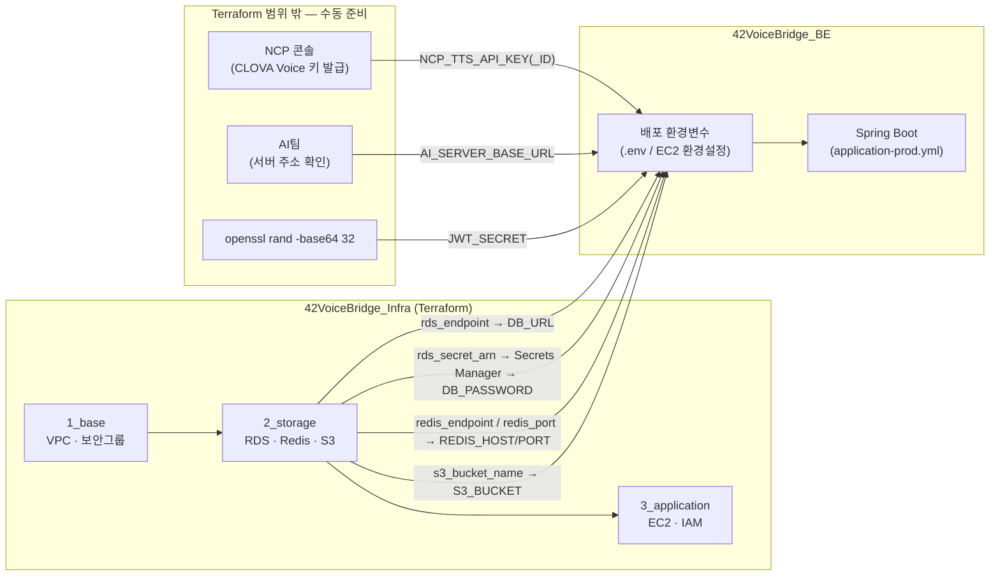

# 배포 환경변수 (Deployment Environment Variables)

`application.yml` / `application-local.yml` / `application-prod.yml` / `docker-compose.yml`에서
`${...}`로 참조하는 환경변수 전체 목록과, 배포(EC2) 시 각 값을 어디서 가져오는지를
정리합니다. 인프라는 [`42VoiceBridge_Infra`](https://github.com/42VoiceBridge/42VoiceBridge_Infra)
저장소가 Terraform으로 관리하며, 레이어형 구조(`1_base` → `2_storage` → `3_application`)로
나뉘어 있습니다.

## 값이 흘러오는 경로



`DB_USERNAME`과 `AWS_REGION`은 다이어그램에는 생략했습니다 — Terraform *output*이 아니라
2_storage/전체 레이어를 `apply`할 때 넣은 **입력 변수(`terraform.tfvars`) 값을 그대로 재사용**하면
되기 때문입니다(아래 표 참고).

## 환경변수 목록

> **필수 여부** 컬럼: 🔴 배포(prod) 시 실제 값 필수 — 기본값이 없거나, 있어도 로컬 전용이라
> 그대로 쓰면 안 됨 / 🟢 로컬 개발은 기본값 그대로 둬도 됨(배포 시에는 별도 판단 필요)

| 변수명 | 용도 | 값 출처 | 필수 여부 |
|---|---|---|---|
| `DB_URL` | RDS 접속 URL(`application-prod.yml`, 기본값 없음) | 42VoiceBridge_Infra `2_storage` 레이어에서 `terraform output rds_endpoint`로 얻은 `호스트:포트`를 `jdbc:mysql://<rds_endpoint>/voicebridge?serverTimezone=Asia/Seoul&characterEncoding=UTF-8` 형태로 조합 | 🔴 배포 필수(로컬은 `application-local.yml`이 URL 자체를 하드코딩 — 이 변수 자체가 없음) |
| `DB_USERNAME` | RDS 마스터 계정명 | `2_storage` 배포 시 `terraform.tfvars`에 넣은 `db_username` 값 그대로(기본값 `voicebridge_admin`) — Terraform output이 아니라 입력값 재사용 | 🔴 배포 필수(로컬 기본값 `root`) |
| `DB_PASSWORD` | RDS 마스터 비밀번호 | `2_storage` 레이어에서:<br>`aws secretsmanager get-secret-value --secret-id $(terraform output -raw rds_secret_arn) --query SecretString --output text \| jq -r .password` | 🔴 배포 필수(로컬 기본값은 빈 문자열 — `docker-compose.yml`의 `MYSQL_ALLOW_EMPTY_PASSWORD=yes`와 짝을 이루므로 로컬은 안 건드려도 됨) |
| `REDIS_HOST` | Redis 호스트 | `2_storage` 레이어에서 `terraform output redis_endpoint` | 🔴 배포 필수(로컬 기본값 `localhost` — `docker-compose`의 Redis 컨테이너로 충분) |
| `REDIS_PORT` | Redis 포트 | `2_storage` 레이어에서 `terraform output redis_port`(현재 구성상 기본값 `6379`와 동일하지만, 값이 바뀔 수 있으니 output으로 확인 권장) | 🟢 로컬은 기본값 `6379`로 충분 |
| `JWT_SECRET` | JWT 서명 키 | Terraform이 관리하지 않는 앱 자체 시크릿 — 배포자가 직접 생성: `openssl rand -base64 32` | 🔴 배포 필수(로컬 기본값은 `local-dev-secret-key-change-me-please-...`처럼 이름부터 "바꾸라"고 박아둔 값이라 절대 그대로 배포하면 안 됨) |
| `AI_SERVER_BASE_URL` | AI 인식 서버(HTTP) 주소 | 이 저장소·Infra 범위 밖 — AI팀에게 실제 배포 주소 확인 | 🔴 배포 필수(로컬 기본값 `http://127.0.0.1:8000`은 AI팀 mock 서버를 직접 띄웠을 때만 의미 있음. `local` 프로파일 기본 구현은 `StubAiInferenceClient`라 이 값 자체를 참조하지 않음) |
| `S3_BUCKET` | 녹음/TTS 오디오 저장 버킷명 | `2_storage` 레이어에서 `terraform output s3_bucket_name` | 🔴 배포 필수(기본값 `voicebridge-recordings`는 실제 버킷명에 붙는 랜덤 접미사가 없어 불일치) |
| `AWS_REGION` | S3 클라이언트 리전 | Infra 각 레이어에 `apply`할 때 쓴 `aws_region` 입력값과 동일(기본 `ap-northeast-2`) — Terraform output이 아니라 배포 시 동일하게 맞추기만 하면 됨 | 🟢 리전을 바꾸지 않았다면 로컬 기본값 그대로 둬도 됨 |
| `NCP_TTS_API_KEY_ID` | 네이버 클라우드 CLOVA Voice 인증 키 ID | NCP 콘솔에서 수동 발급(Infra/Terraform 범위 밖) | 🔴 배포 필수(로컬 기본값은 빈 문자열 — TTS 기능을 실제로 테스트하려면 로컬에서도 값 필요) |
| `NCP_TTS_API_KEY` | 네이버 클라우드 CLOVA Voice 인증 키 | NCP 콘솔에서 수동 발급(Infra/Terraform 범위 밖) | 🔴 배포 필수(위와 동일) |

### 참고 — `docker-compose.yml`의 `DB_PASSWORD`

로컬 MySQL 컨테이너의 root 비밀번호로 같은 이름(`DB_PASSWORD`)을 재사용합니다
(`MYSQL_ROOT_PASSWORD: ${DB_PASSWORD:-}`, 기본값은 빈 문자열이며
`MYSQL_ALLOW_EMPTY_PASSWORD: "yes"`와 함께 동작). 배포용 값과는 무관한 **로컬 편의 전용**
설정이니 배포 시 실제 `DB_PASSWORD` 값을 로컬 `docker-compose`에 흘려 넣지 마세요.

### `SPRING_PROFILES_ACTIVE`에 대해

위 표는 코드에 `${...}`로 명시적으로 참조된 변수만 다룹니다. `SPRING_PROFILES_ACTIVE=prod`는
Spring Boot 표준 방식으로 프로파일을 전환하는 값이라(`${}` 플레이스홀더가 아님) 표에는
넣지 않았지만, **배포 환경에서 반드시 함께 설정해야** `application-prod.yml`이 적용되고
위 필수값들이 실제로 요구됩니다. 설정하지 않으면 기본 프로파일(`local`)로 뜨면서 로컬 기본값이
그대로 쓰입니다.

## 값을 EC2에 전달하는 방법

42VoiceBridge_Infra는 아직 `4_exposure`(CI/CD) 레이어가 없어 자동 배포 파이프라인이
정해지지 않았습니다. 그때까지는 EC2에 SSH로 접속해 `.env` 파일을 만들고(루트의
[`.env.example`](../.env.example) 참고), 애플리케이션 실행 시 이를 읽어들이는 방식으로
운영합니다. 자동 배포가 도입되면 이 절을 갱신합니다.

## 조회 명령 모음

```bash
# 42VoiceBridge_Infra 저장소에서 실행
cd environments/dev/2_storage

terraform output rds_endpoint
terraform output redis_endpoint
terraform output redis_port
terraform output s3_bucket_name

SECRET_ARN=$(terraform output -raw rds_secret_arn)
aws secretsmanager get-secret-value --secret-id "$SECRET_ARN" \
  --query 'SecretString' --output text | jq -r .password
```
